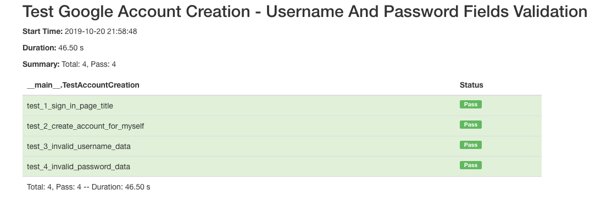

## Google Account creation automation testing with Page Object model


### Install dependencies
````
pip install -r requirements.txt
````

### Create page objects:
+ Sign In page
+ Create Account page

### Test cases:
+ Test navigation to Sign In page
+ Test create account button
+ Test account - username validation
+ Test account - password validation

### Reports:
+ Test runner generates HTML report and saves it to the ./tests/reports folder
+ By default, after tests execution it opens report in default system browser

#### Example of the test runner report:

